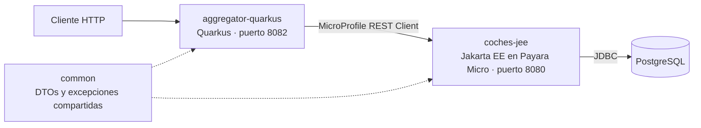

# Microservicios de Coches con Jakarta EE y Quarkus

Sistema de dos microservicios para gestionar un catálogo de coches (consultar, crear, modificar y eliminar), desarrollado con **Java**, **Jakarta EE**, **Quarkus** y **PostgreSQL**. Los dos servicios se comunican entre sí mediante **MicroProfile REST Client** y están organizados siguiendo una **arquitectura hexagonal**.

## Contexto

Desarrollé este proyecto para preparar el **segundo examen parcial** de la asignatura **Desarrollo y Administración de Sistemas de Información** (DASI), de 3.º de Ingeniería Informática en la Universidad Pontificia de Salamanca (curso 2025/26).

En ese examen obtuve un **10**, y en el conjunto de la asignatura, **Matrícula de Honor**.

Es el segundo de tres proyectos de estudio de la asignatura, cada uno preparado para un examen:

1. [Primer parcial](https://github.com/AdrianRubioSevillano/canciones-api-quarkus): API REST con Quarkus, arquitectura hexagonal y acceso a datos con JDBC.
2. **Segundo parcial** (este proyecto): microservicios con Jakarta EE y Quarkus, validación de datos y gestión de errores entre servicios.
3. Examen global (próximamente)

## Tecnologías

| Área | Tecnología |
|---|---|
| Lenguaje | Java 21 |
| Microservicio de datos | Jakarta EE (JAX-RS, CDI, Bean Validation) desplegado en Payara Micro 7 |
| Microservicio agregador | Quarkus 3.27 (Quarkus REST) |
| Comunicación entre servicios | MicroProfile REST Client |
| Base de datos | PostgreSQL 18 |
| Acceso a datos | JDBC con `PreparedStatement` y `@DataSourceDefinition` |
| Contenedores | Docker y Docker Compose |
| Conversión entre capas | MapStruct |
| Reducción de código repetitivo | Lombok |
| Gestión del proyecto | Maven (proyecto multimódulo) |

## Arquitectura

El sistema está formado por dos microservicios y un módulo compartido:



| Módulo | Qué hace |
|---|---|
| `coches-jee` | Microservicio de datos. Expone la API de coches, valida los datos recibidos y accede a PostgreSQL |
| `aggregator-quarkus` | Microservicio que recibe las peticiones del cliente y las reenvía a `coches-jee`. Traduce las respuestas de error del otro servicio (404, 400) a excepciones propias y las devuelve al cliente con su código HTTP |
| `common` | Objetos de respuesta y excepciones que comparten los dos servicios, para que ambos hablen el mismo "idioma" |

### Capas de `coches-jee`

| Capa | Qué contiene |
|---|---|
| `adapters.rest` | Los endpoints, los objetos de entrada con sus reglas de validación y los `ExceptionMapper` que convierten los errores en respuestas HTTP |
| `application.usecases` | Un caso de uso por cada operación: buscar, insertar, actualizar, eliminar... |
| `domain` | El modelo de `Coche` y la interfaz `Repository`, que define qué operaciones existen sin decir cómo se hacen |
| `infrastructure` | El acceso a PostgreSQL con JDBC y una anotación de validación propia, `@Url`, para comprobar que las páginas web son direcciones válidas |

## Validación de datos

Al crear o modificar un coche, `coches-jee` comprueba los datos antes de guardarlos. Si alguno no es válido, responde con un `400` y la lista de errores encontrados.

| Campo | Regla |
|---|---|
| `marca` | Obligatoria, entre 3 y 100 caracteres |
| `modelo` | Obligatorio, entre 3 y 100 caracteres |
| `anioLanzamiento` | 4 dígitos |
| `caballos` | Entre 30 y 9999 |
| `paginaWeb` | Dirección web válida, entre 15 y 300 caracteres (validación propia con `@Url`) |

## Estructura del proyecto

```
.
├── docker-compose.yml         # Base de datos PostgreSQL en Docker
├── database.sql               # Creación de la tabla y datos de ejemplo
├── cochesRequest.http         # Peticiones de ejemplo a coches-jee (puerto 8080)
├── aggregatorRequest.http     # Peticiones de ejemplo al aggregator (puerto 8082)
├── common/                    # Módulo compartido
├── coches-jee/                # Microservicio Jakarta EE
└── aggregator-quarkus/        # Microservicio Quarkus
```

## Cómo ejecutarlo

### Requisitos

- Java 21
- Docker
- [Payara Micro 7](https://www.payara.fish/downloads/payara-platform-community-edition/): se descarga como un único archivo `.jar`

No hace falta instalar Maven ni PostgreSQL: el proyecto incluye Maven Wrapper y la base de datos se levanta con Docker.

### Pasos

**1. Clonar el repositorio**

```bash
git clone https://github.com/AdrianRubioSevillano/coches-microservicios-jakarta-quarkus.git
cd coches-microservicios-jakarta-quarkus
```

**2. Levantar la base de datos**

```bash
docker compose up -d
```

Docker descarga PostgreSQL, crea la base de datos y ejecuta `database.sql`, que crea la tabla y añade varios coches de ejemplo.

**3. Compilar los tres módulos**

```bash
cd coches-jee
./mvnw -f ../pom.xml clean install
cd ..
```

Este comando compila todo el proyecto de una vez: `common`, `coches-jee` (genera `ROOT.war`) y `aggregator-quarkus` (genera un `.jar` ejecutable).

**4. Arrancar `coches-jee`** (en una terminal, desde la carpeta raíz)

```bash
java -jar <ruta-a>/payara-micro-7.2026.1.jar --noCluster --port 8080 --deploy coches-jee/target/ROOT.war
```

Sustituye `<ruta-a>` por la carpeta donde descargaste Payara Micro.

Si tienes Payara Micro en `/opt/payara/micro/`, también puedes arrancarlo desde la carpeta `coches-jee` con el script incluido:

```bash
cd coches-jee
sh coches.sh
```

**5. Arrancar `aggregator-quarkus`** (en otra terminal, desde la carpeta raíz)

```bash
java -jar aggregator-quarkus/target/aggregator-quarkus-1.0.0-runner.jar
```

Con los dos servicios en marcha:

- `coches-jee` está disponible en `http://localhost:8080/coches`.
- `aggregator-quarkus` está disponible en `http://localhost:8082/coches`.

**6. Apagar la base de datos** (desde la carpeta raíz, cuando termines)

```bash
docker compose down
```

> **Nota:** si ya tienes PostgreSQL instalado en tu equipo y encendido, apágalo antes del paso 2, porque ambos usan el puerto 5432.

### Credenciales

El usuario y la contraseña de la base de datos (`postgres` / `postgres`) son valores de prueba para la base de datos local que crea Docker. Para conectar `coches-jee` a otra base de datos, se pueden indicar otros mediante las variables de entorno `DB_USER` y `DB_PASSWORD`, sin modificar el código.

## Endpoints

Los dos servicios ofrecen las mismas rutas. Lo normal es usar el aggregator (puerto `8082`), que reenvía cada petición a `coches-jee` (puerto `8080`).

| Método | Ruta | Descripción | Respuesta |
|---|---|---|---|
| `GET` | `/coches` | Lista todos los coches, ordenados de más a menos caballos | `200` |
| `GET` | `/coches/{id}` | Muestra el detalle de un coche | `200` / `404` |
| `POST` | `/coches` | Crea un coche | `201` / `400` |
| `PUT` | `/coches/{id}` | Modifica los datos de un coche | `204` / `400` / `404` |
| `DELETE` | `/coches/{id}` | Elimina un coche | `204` / `404` |

### Ejemplo: crear un coche

**Petición**

```http
POST http://localhost:8082/coches
Content-Type: application/json

{
  "marca": "Lamborghini",
  "modelo": "Urus",
  "anioLanzamiento": "2018",
  "caballos": 650,
  "paginaWeb": "https://www.lamborghini.com"
}
```

**Respuesta:** `201 Created`

```json
{
  "id": 4,
  "marca": "Lamborghini",
  "modelo": "Urus",
  "anioLanzamiento": "2018",
  "caballos": 650,
  "paginaWeb": "https://www.lamborghini.com"
}
```

### Ejemplo: datos no válidos

Si se envía la misma petición con la marca vacía y una dirección web incorrecta (`"paginaWeb": "://www.urus.com"`), la respuesta es `400 Bad Request` con un error por cada campo que no cumple las reglas:

```json
[
  {
    "message": "no debe estar vacío",
    "status": "insertCoche.arg0.marca"
  },
  {
    "message": "La URL introducida no es valida.",
    "status": "insertCoche.arg0.paginaWeb"
  }
]
```

Los archivos [`cochesRequest.http`](cochesRequest.http) y [`aggregatorRequest.http`](aggregatorRequest.http) incluyen ejemplos de todas las peticiones, listos para ejecutar desde IntelliJ IDEA o desde VS Code con la extensión REST Client.

## Autor

**Adrián Rubio Sevillano**: estudiante de Ingeniería Informática en la Universidad Pontificia de Salamanca.

[LinkedIn](https://www.linkedin.com/in/adrian-rubio-sevillano)
